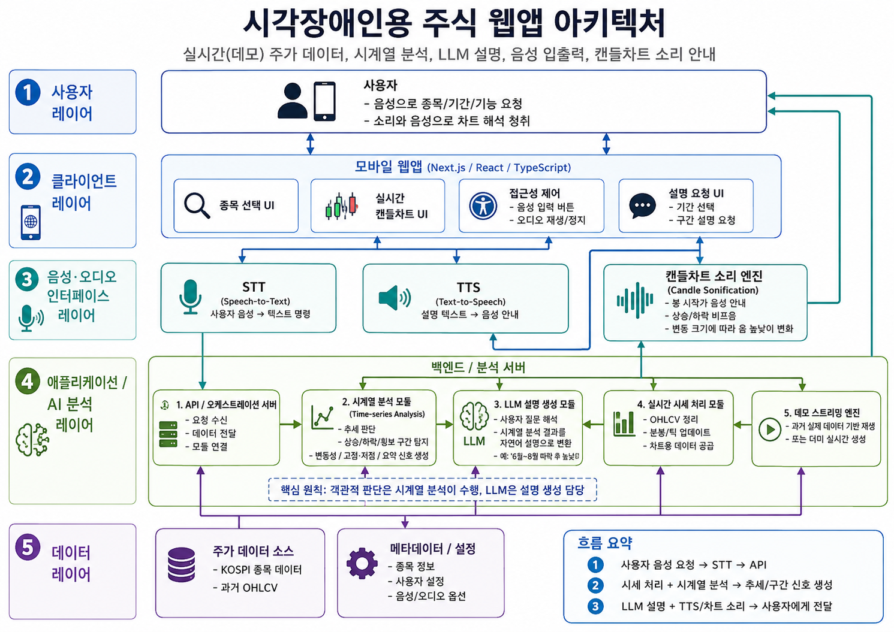

# 시각장애인용 주식 웹앱

> 캔들차트를 **음성, 비프음, 구조화된 자연어 설명**으로 변환하여 시각장애인의 주가 흐름 이해를 지원하는 모바일 웹 데모입니다.

<p align="center">
  
  
  
  
</p>

## 프로젝트 소개

일반적인 주식 서비스는 캔들차트의 색상, 길이, 기울기와 위치에 많은 정보를 의존합니다. 이 프로젝트는 해당 시각 정보를 다음과 같은 비시각적 인터페이스로 변환합니다.

- **캔들차트 소리 변환**: 상승·하락 방향과 변동 폭을 비프음의 높이 및 패턴으로 전달
- **구간별 시계열 분석**: 상승, 하락, 횡보, 변동성, 고점·저점 등의 객관적 신호 생성
- **자연어 차트 설명**: 분석 결과를 LLM이 이해하기 쉬운 문장으로 변환
- **음성 입출력**: STT로 명령을 입력하고 TTS로 분석 결과를 청취
- **모바일 접근성**: 스크린 리더, 키보드 탐색, ARIA 상태 안내를 고려한 UI

본 프로젝트는 **기능 시연을 위한 데모**입니다. 실시간 증권사 주문 체결이나 투자 자문 기능을 제공하지 않습니다.

---

## 주요 기능

### 1. 음성 기반 종목 및 기능 선택

사용자는 화면을 직접 탐색하지 않고도 음성으로 주요 기능을 실행할 수 있습니다.

```text
“삼성전자 선택해 줘”
“5분봉으로 바꿔 줘”
“지난 3개월 흐름을 설명해 줘”
“차트 소리를 시작해 줘”
```

STT가 음성을 텍스트 명령으로 변환하고, 명령 파서가 종목·기간·봉 단위·실행 기능을 구조화합니다.

### 2. 실시간형 캔들차트 소리 변환

각 캔들의 기준가와 현재가 차이를 오디오 신호로 변환합니다.

- 새 봉 시작 시 시작가를 TTS로 안내
- 기준가보다 상승하면 상승 비프음 재생
- 기준가보다 하락하면 하락 비프음 재생
- 기준가 부근의 작은 움직임은 무음 처리하여 노이즈 감소
- 변동 폭이 클수록 음 높이 또는 반복 간격을 크게 변화
- 재생, 일시 정지, 음량, 민감도, 무음 구간 설정 지원

### 3. 시계열 기반 차트 구간 분석

가격 데이터는 규칙 기반 시계열 분석 모듈에서 먼저 처리됩니다.

- 상승·하락·횡보 구간 분할
- 이동 변화율 및 기울기 계산
- 변동성 변화 탐지
- 국소 고점·저점 탐지
- 주요 반전 구간 및 최대 변동 구간 추출
- 기간 전체 요약 신호 생성

분석 결과는 다음과 같은 구조화 데이터로 생성할 수 있습니다.

```json
{
  "symbol": "005930",
  "period": "2026-04-01~2026-07-01",
  "overallTrend": "sideways",
  "segments": [
    { "start": "2026-04-01", "end": "2026-05-10", "trend": "up" },
    { "start": "2026-05-11", "end": "2026-06-03", "trend": "down" },
    { "start": "2026-06-04", "end": "2026-07-01", "trend": "sideways" }
  ],
  "volatility": "medium"
}
```

### 4. LLM 기반 자연어 설명

LLM은 원본 차트를 임의로 해석하지 않고, **시계열 분석 모듈이 생성한 구조화 결과를 자연어로 변환하는 역할**을 담당합니다.

```text
4월 초부터 5월 초까지 완만한 상승세가 이어졌습니다.
이후 6월 초까지 하락했으며, 최근에는 좁은 범위에서 횡보하고 있습니다.
```

> **핵심 원칙**  
> 추세와 구간에 대한 객관적 판단은 시계열 분석 모듈이 수행하고, LLM은 결과 설명과 사용자 질문에 맞는 표현만 생성합니다.

### 5. TTS 기반 결과 안내

- 현재가 및 봉 시작가 안내
- 차트 분석 결과 읽기
- 종목 및 기간 변경 결과 안내
- 오류·로딩·재생 상태 안내
- 긴 설명의 일시 정지 및 다시 듣기

---

## 시스템 아키텍처

<p align="center">
  
</p>

### 전체 처리 흐름

```text
사용자 음성 입력
    ↓
STT 및 명령 구조화
    ↓
API / 오케스트레이션
    ├─ 종목·기간 데이터 조회
    ├─ 실시간형 OHLCV 스트림 생성
    └─ 시계열 분석 실행
            ↓
     구조화된 분석 결과
            ↓
     LLM 자연어 설명 생성
            ↓
   화면 텍스트 + TTS 음성 출력

OHLCV 스트림
    ├─ 캔들차트 UI 갱신
    └─ 캔들차트 소리 엔진 입력
```

---

## 기술 스택

| 영역 | 기술 |
|---|---|
| Frontend | Next.js, React, TypeScript |
| Styling | Tailwind CSS 또는 CSS Modules |
| Chart | Canvas/SVG 기반 캔들차트 또는 Lightweight Charts |
| Audio | Web Audio API |
| STT | Web Speech API 또는 외부 STT API |
| TTS | SpeechSynthesis API 또는 외부 TTS API |
| API | Next.js Route Handler 또는 별도 분석 서버 |
| Analysis | TypeScript/Python 기반 시계열 분석 모듈 |
| LLM | 서버 측 LLM API 연동 |
| Data | 시세 API |

---

## 디렉터리 구조 예시

```text
.
├── app/
│   ├── api/
│   │   ├── analyze/route.ts       # 시계열 분석 및 설명 요청
│   │   ├── speech/route.ts        # 외부 STT/TTS 연동 시 사용
│   │   └── stocks/route.ts        # 종목 및 시세 데이터 제공
│   ├── page.tsx
│   └── layout.tsx
├── components/
│   ├── StockSelector.tsx
│   ├── CandlestickChart.tsx
│   ├── SonificationController.tsx
│   ├── VoiceCommandButton.tsx
│   ├── AnalysisResult.tsx
│   └── AccessibilityControls.tsx
├── lib/
│   ├── analysis/
│   │   ├── trend.ts               # 상승·하락·횡보 판정
│   │   ├── segmentation.ts        # 구간 분할
│   │   └── summarize.ts           # 구조화된 분석 결과 생성
│   ├── audio/
│   │   ├── sonification.ts        # 캔들 소리 매핑
│   │   └── speech.ts              # STT/TTS 제어
│   └── llm/
│       └── explain.ts             # 분석 결과의 자연어 변환
├── public/
│   └── sounds/
├── docs/
│   └── architecture.png
├── types/
│   └── stock.ts
├── .env.example
└── README.md
```

---

## 실행 방법

### 1. 저장소 클론

```bash
git clone <REPOSITORY_URL>
cd <PROJECT_DIRECTORY>
```

### 2. 의존성 설치

```bash
npm install
```

### 3. 환경 변수 설정

```bash
cp .env.example .env.local
```

`.env.local` 예시:

```env
# 브라우저 음성 기능 또는 외부 API 선택
NEXT_PUBLIC_STT_PROVIDER=browser
NEXT_PUBLIC_TTS_PROVIDER=browser

# LLM 설명 기능을 사용하는 경우 서버 전용으로 설정
LLM_API_KEY=
LLM_MODEL=

# 외부 시세 API 연동 시 사용
STOCK_API_BASE_URL=
STOCK_API_KEY=
```

> API 키는 `NEXT_PUBLIC_` 접두사를 붙이지 않고 서버 환경 변수로 관리해야 합니다.

### 4. 개발 서버 실행

```bash
npm run dev
```

브라우저에서 다음 주소를 엽니다.

```text
http://localhost:3000
```

### 5. 프로덕션 빌드 확인

```bash
npm run build
npm run start
```

---

## 접근성 설계 원칙

- 모든 핵심 기능을 키보드와 스크린 리더로 실행 가능하게 구성
- 버튼에 명확한 `aria-label` 제공
- 현재가, 종목 변경, 분석 완료 등의 상태를 `aria-live`로 안내
- 색상만으로 상승과 하락을 구분하지 않음
- 오디오 재생 여부와 현재 상태를 텍스트로도 제공
- 반복 비프음의 빈도·음량·민감도를 사용자가 조절 가능하게 제공
- 자동 재생 전 사용자 입력을 받아 브라우저 오디오 정책 준수
- 긴 음성 설명을 중단하거나 다시 들을 수 있는 제어 기능 제공
- 진동 기능은 브라우저 및 기기 지원 여부에 따라 보조 수단으로만 사용

---

## 시계열 분석과 LLM의 역할 분리

| 모듈 | 담당 역할 | 담당하지 않는 역할 |
|---|---|---|
| 시계열 분석 | 변화율 계산, 추세 판정, 구간 분할, 변동성 및 고저점 탐지 | 자연스러운 문장 생성 |
| LLM | 분석 결과 설명, 질문에 맞는 표현, 설명 길이 조절 | 가격 예측, 임의 추세 판정, 투자 추천 |
| TTS | 설명 텍스트 음성 출력 | 분석 및 판단 |
| 소리 엔진 | 현재 가격 변화를 실시간 오디오 패턴으로 변환 | 장기 추세 판단 |

이 구조를 통해 동일한 입력 데이터에 대해 분석 기준을 일정하게 유지하고, LLM의 주관적 추론이 결과에 직접 개입하는 것을 제한합니다.

---

## 향후 확장 계획

- [ ] 실제 증권 시세 WebSocket 연동
- [ ] 음성 명령의 종목명·기간 인식 정확도 개선
- [ ] 사용자별 음 높이 및 변동 민감도 프리셋
- [ ] 고점·저점 및 거래량 변화 전용 소리 패턴
- [ ] 점자정보단말기용 구조화 텍스트 출력
- [ ] 분석 결과의 근거 수치 함께 제공
- [ ] 접근성 사용자 테스트 및 WCAG 기준 점검
- [ ] 모의투자 API 연동

---

## License

이 프로젝트는 MIT License를 따릅니다.
